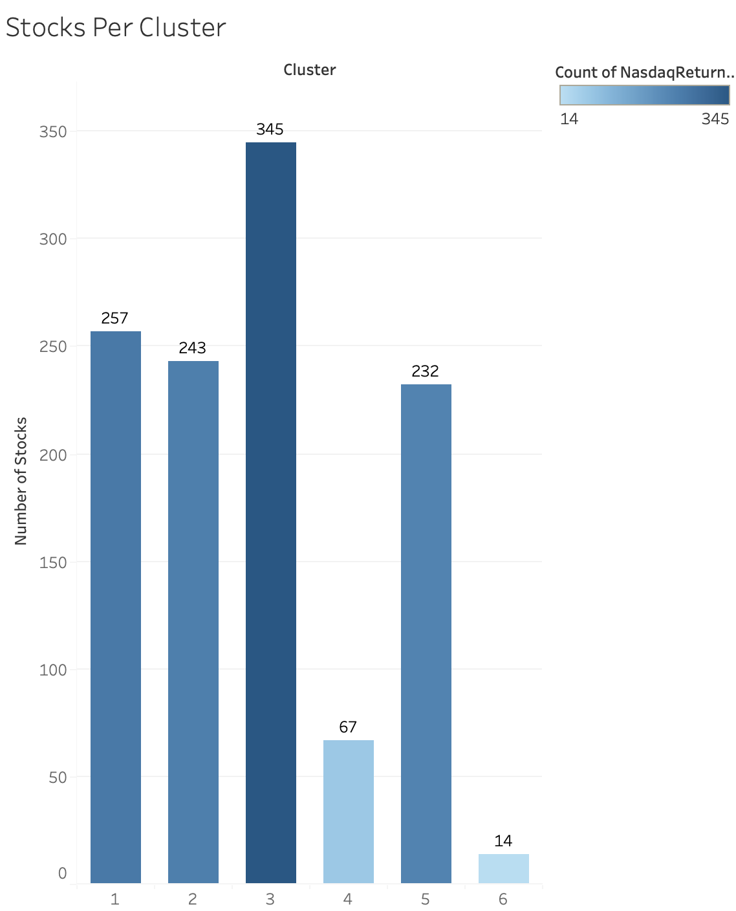
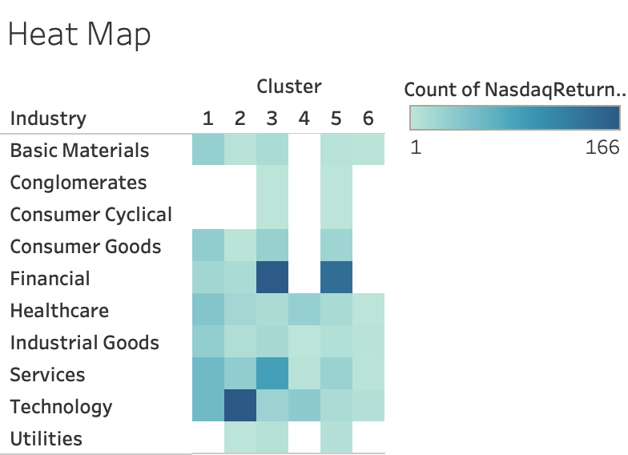
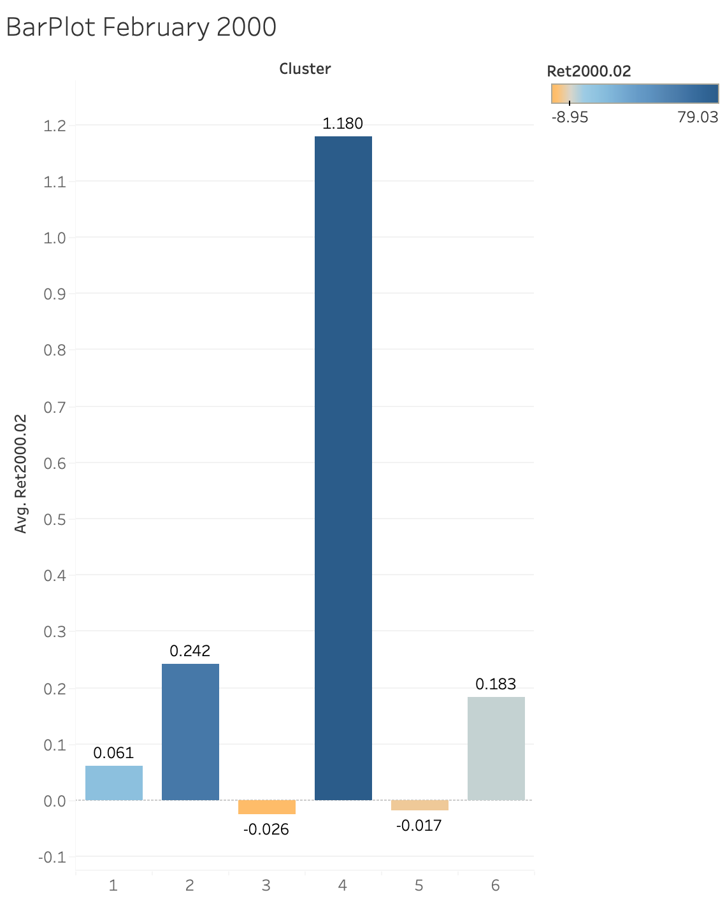

```{r setup, include=FALSE}
library(mosaic)
library(formatR)
library(leaps)
library(dplyr)
```

# PART I

```{r}
#Read in data
data = read.csv('./NasdaqReturns.csv')
```

# (a)

```{r}
num_companies <- n_distinct(data$StockSymbol)
companies_per_industry <- data %>%
  group_by(Industry) %>%
  summarise(num_companies = n_distinct(StockSymbol))

print(paste("Number of companies:", num_companies))
print("Number of companies per industry:")
print(companies_per_industry)
```

# (b)

```{r}
dec2000_ret <- data %>%
  select(StockSymbol, Ret2000.12)

inc_10_orMore <- sum(dec2000_ret$Ret2000.12 >= 0.10, na.rm = TRUE)
dec_10_orMore <- sum(dec2000_ret$Ret2000.12 <= -0.10, na.rm = TRUE)

print(paste("Number of stocks with an increase of 10% or more in December 2000:", inc_10_orMore))
print(paste("Number of stocks with a decrease of 10% or more in December 2000:", dec_10_orMore))
```

# (c)

```{r}
oct2008_avgRet <- data %>%
  group_by(Industry) %>%
  summarise(avg_ret = mean(Ret2008.10, na.rm = TRUE))

worst_industries_oct2008 <- oct2008_avgRet %>%
  arrange(avg_ret) %>%
  head(3)

print("Industries with the worst average return in October 2008:")
print(worst_industries_oct2008)
```

# PART II

# (a)

```{r}
#Read in data
data = read.csv('./NasdaqReturns.csv')

# Preparing the modified data for clustering
ret_data <- select(data, Ret2000.01:Ret2009.12)

summary(select(ret_data, Ret2000.01:Ret2000.04))
```

All variables (monthly returns from Ret2000.01 to Ret2009.12) in this dataset are measured using the same unit of measurement, which is the proportionate change in stock value. It isn't necessarily essential to normalise them because they are already on an equivalent scale. Normalisation is usually essential when variables have various units or drastically different scales, in order to make sure that no one variable significantly affects the clustering findings.

For instance as we can see from our summary, by comparing the min and max value of respective observations, the magnitude of their proportions is not high enough to require normalisation. The highest magnitude being in the case of Ret2000.03 = 4.00862/0.71299 = 5.66.

# (b)

```{r}
#Calculating distances using Euclidean method
distances = dist(ret_data, method = 'euclidean')

#Hierarchical Clustering algorithm
clusters = hclust(distances, method = 'ward.D')

#Plotting the dendogram
plot(clusters, labels = FALSE)

#Clusters selection
rect.hclust(clusters, k=6, border="blue")
```

Keeping in mind that we need to maximize our clusters while also maintaining the stability as high as possible, based on the dendogram I obtained, I decided to select 6 clusters to use for the rest of our problem. Stability here refers to the variation in our assigned clusters as we move up and down the dendogram. After analysing some of the choices as possible selections, I was able to come to the conclusion that selecting 6 clusters formed a perfect balance between the number of clusters and stability. Hence, moving forward I will be using 6 clusters for my analysis.

# (c)

```{r}
# Extracting cluster groups assignments
cluster_assignments = cutree(clusters, k = 6)

#Adding cluster assignments to the original data
data_with_clusters <- data %>%
  mutate(Cluster = cluster_assignments)

#Saving the new data frame as a CSV file
write.csv(data_with_clusters, "NasdaqReturns_with_Clusters.csv", row.names = FALSE)
```

# (d)


From the above graph it is evident that majority of the clusters have even distribution, indicating that our choice of slecting 6 clusters has grouped similar stocks effectively and hence our choice is justified. The clusters 4 and 6 seem to have lesser stocks in comparison to the other 4 indicating that they are outliers and possess a return pattern significantly different from others. Cluster 3 seem to have the most number of stocks with 345, whereas clusters 1, 2, and 5 have similar number of stocks with 257, 243 and 232 respectively.

# (e)



The provided heat map visualizes the distribution of stocks in different clusters across various industries where, each cell in the illustration represents the no. of stocks belonging to a specific industry and cluster combination. Noticably, some cells are darker than the others, as shown in the color legend, the intensity of the color signifies the number of stocks for that particular combination. For instance, from the figure it can be concurred that cluster 5 possesses some stocks from all the industries but the number of stocks from the financial industry is the highest in this cluster.

# (f)



From the figure above it can be concluded that clusters 3 and 5 had negative returns for the month of February 2000 with average returns of -0.026 and -0.017 respectively. Whereas, clusters 1, 2, 4, and 6 exhibited positive average returns with the returns being 0.061, 0.242, 1.180 and 0.183 respectively.

# (g)

We are going to use the clustering data to make sure that our portfolio contains stocks from several clusters, so offering a diversified portfolio of equities to reduce overall risk. By choosing stocks that are not highly correlated, this strategy seeks to diversify the portfolio and lower overall risk. In order to achieve this, I will be following the following steps:

(i) In order to form a diverse portfolio, select one stock from each of the identified clusters.
(ii) Minimize risk by selecting stocks of well performing companies from each cluster, I achieved this by calculating the average return of the companies over the given period.
(iii) Avoid industry specific risks by choosing stocks from different industries.


Proposed Portfolio:

Stock 1 (from Cluster 1): AFAM (Industry: Healthcare)
Stock 2 (from Cluster 2): ISRL (Industry: Basic Materials)
Stock 3 (from Cluster 3): CEDC (Industry: Consumer Goods)
Stock 4 (from Cluster 4): EZCH (Industry: Technology)
Stock 5 (from Cluster 5): STRA (Industry: Services)
Stock 6 (from Cluster 6): IDSA (Industry: Industrial Goods)