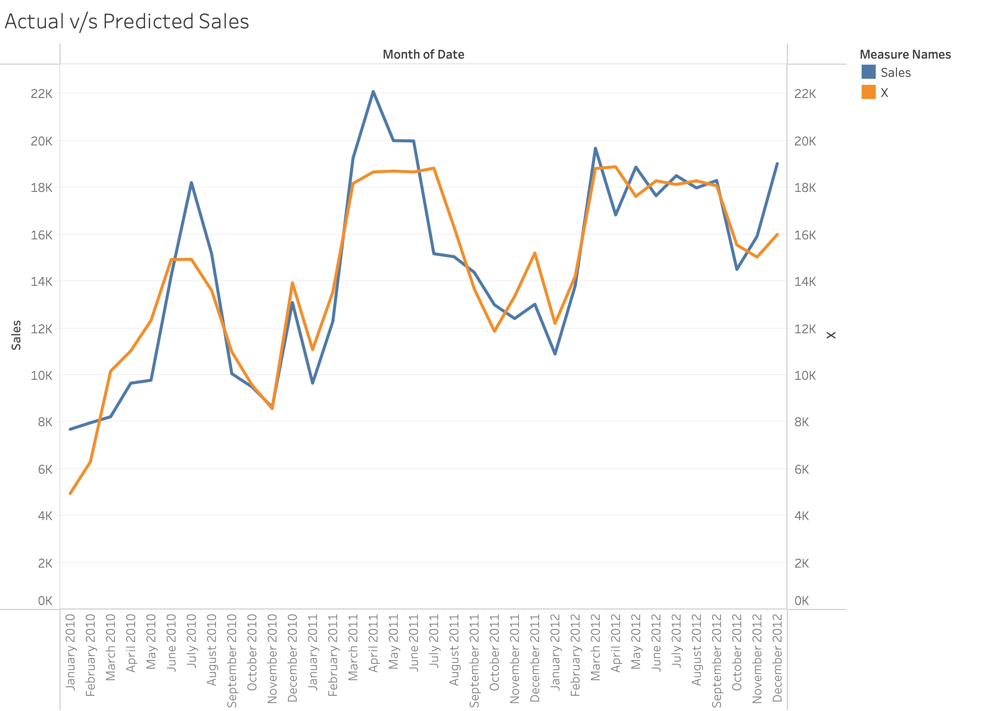

```{r setup, include=FALSE}
library(mosaic)
library(formatR)
library(leaps)
library(dplyr)
```

# PART 1: Data Exploration

# a)

```{r}
# Load the data
data <- read.csv('./Honda_Sales.csv')

# Splitting the data into training and testing sets
train_data <- data %>% filter(Year <= 12)
test_data <- data %>% filter(Year >= 13)
```

# a)(i)

```{r}
# Calculating the percentages
total_size <- nrow(data)
train_size <- nrow(train_data)
test_size <- nrow(test_data)

train_per <- (train_size / total_size) * 100
test_per <- (test_size / total_size) * 100

# Printing the percentages
print(paste("Training data percentage:", train_per, "%"))
print(paste("Testing data percentage:", test_per, "%"))
```

# a)(ii)

```{r}
# Saving the training data to a CSV file
write.csv(train_data, 'Honda_Sales_Training.csv', row.names = FALSE)
```

.png)

# a)(iii)

After observation from the graph illustrated above, one thing that stands out is that the sales tend to spike during the spring season every year, another thing that can be observed with the naked eye is that the average sales for each year also follows an upward trend. Moreover, the month with least sales from 2010 to 2012 was January 2010 with 7,690 sales, and the month with the most sales was April 2011 with 22,100 sales.

# PART 2: Building the Model

# a)

```{r}
#Building model1
model1 <- lm(Sales ~ Unemployment + CPI_All + CPI_Energy + Queries, data = train_data)
summary(model1)
```

# a)(i)

```{r}
# model1 R-squared value
model1_r2 <- summary(model1)$r.squared
model1_r2
```

```{r}
# Getting significant variables
model1_sig_vars <- summary(model1)$coefficients[,4] < 0.10  # 90% confidence interval
model1_sig_vars
```

So, none of the variables in model1 are significant assuming 90% confidence interval.

# b)

```{r}
# Building model2
model2 <- lm(Sales ~ Unemployment + CPI_All + CPI_Energy + Queries + Year + Month, data = train_data)
summary(model2)
```

# b)(i)

```{r}
# model2 R-squared value
model2_r2 <- summary(model2)$r.squared
model2_r2
```

```{r}
# Getting significant variables
model2_sig_vars <- summary(model2)$coefficients[,4] < 0.10  # 90% confidence interval
model2_sig_vars
```

Again, none of the variables in model2 are significant assuming 90% confidence interval.

# b)(ii)

Even though the R-squared value in model2 was 45.92% in comparison to 42.82% in model1, our primary focus in order to evaluate which model performs better should be the adjusted R-squared values as we introduced two new variables (Year and Month) in model2. It can be deduced from the summary of the models that model1 adj. R-squared = 35.44%, whereas model2 adj. R-squared = 34.73%. This means, that the addition of the new variables did not increase the model significantly, instead it multicollinearity, meaning they might be correlated with other variables in the model, which ended up not improving the model’s ability to explain the variability in sales substantially. This indicates that the addition of new variables in model2 only ended up overfitting the model, increasing the complexity. Hence, model2 does not perform better than model1.

# c)

As months are categorical, they shouldn't be viewed as having a linear, numerical connection, so we must convert Month to a factor variable. Sales can be impacted by a variety of factors, including seasonality, holidays, marketing campaigns, and other events, in each given month. The model may accommodate non-linear and non-sequential fluctuations by appropriately accounting for the distinct influence of each month on sales through the use of a factor variable.

# c)(i)

```{r}
# Converting Month to a factor variable
train_data$Month_Factor <- as.factor(train_data$Month)
test_data$Month_Factor <- as.factor(test_data$Month)
```

# c)(ii)

```{r}
# Building model3
model3 <- lm(Sales ~ Unemployment + CPI_All + CPI_Energy + Queries + Year + Month_Factor, data = train_data)
summary(model3)
```

# c)(iii)

```{r}
# model3 R-squared value
model3_r2 <- summary(model3)$r.squared
model3_r2
```

# c)(iv)

Indeed, the model performs noticeably better than both models 1 and 2. This is explained by the high r-squared value of 83.43%, which indicates that 83% of the variability in the response variable is explained by the model. Furthermore, the new model's efficacy is demonstrated by its high adjusted value of 69.43%

# d)

```{r}
# Applying step-wise elimination to model3
best_model <- step(model3)
```

```{r}
summary(best_model)
```

# d)(i)

```{r}
# best_model R-squared value
best_model_r2 <- summary(model3)$r.squared
best_model_r2
```

```{r}
# Finding removed variables
removed_vars <- setdiff(names(coef(model3)), names(coef(best_model)))
removed_vars
```

# d)(ii)

```{r}
# Regression equation for best model
best_model_eq <- formula(best_model)
best_model_eq
```

Sales = 413900.69 − 5950.79 ∗ (Unemployment) − 2171.71 ∗ (CPIAll) + 314.63 ∗ (CPI_Energy) + 5391.56 ∗ (Y ear) + 2562.10 ∗ (MonthF actor2) +
        7380.28 ∗ (MonthF actor3) + ∗(MonthF actor4) + 8686.44 ∗ (MonthF actor5) + 
        10700.42 ∗ (MonthF actor6)+11313.12 ∗ (MonthF actor7)+10053.29 ∗ (MonthF actor8) +
        7727.56 ∗ (MonthF actor9) + 5787.00 ∗ (MonthF actor10) + 6860.28 ∗ (MonthF actor11) + 6860.28 ∗ (MonthF actor12)
      
# d)(iii)

Coeff. of the Year variable = 5391.559

This means that for each additional year, the monthly sales of Honda Civic are expected to increase by 5391.56 units, while keeping all other variables constant.

# d)(iv)

```{r}
# making predictions
predict_train <- predict(best_model, newdata = train_data)
train_data$PredictTrain <- predict_train
```

# d)(v)

```{r}
library(Metrics)

# Calculating RMSE, MAE, and MAPE for the training dataset
rmse_value <- rmse(train_data$Sales, train_data$PredictTrain)
print(paste("RMSE value:", rmse_value))
```

```{r}
mae_value <- mae(train_data$Sales, train_data$PredictTrain)
print(paste("MAE value:", mae_value))
```

```{r}
mape_value <- mape(train_data$Sales, train_data$PredictTrain)
print(paste("MAPE value:", mape_value))
```

# d)(vi)

```{r}
write.csv(predict_train, 'predict_train.csv', row.names = TRUE)
```



# Part 3: Model’s Out-of-Sample Performance

# a) 

```{r}
# Making predictions on testing data
predict_test <- predict(best_model, newdata = test_data)
test_data$PredictTest <- predict_test
```

# b)

```{r}
# Saving testing data in 'testing_data.csv'
write.csv(test_data, "testing_data.csv")

# Saving predicted data
write.csv(predict_test, 'predict_test.csv', row.names = TRUE)
```

.png)

# c)

```{r}
# Calculating RMSE, MAE, and MAPE for the testing dataset
rmse_value <- rmse(test_data$Sales, predict_test)
print(paste("RMSE value:", rmse_value))
```

```{r}
mae_value <- mae(test_data$Sales, predict_test)
print(paste("MAE value:", mae_value))
```

```{r}
mape_value <- mape(test_data$Sales, predict_test)
print(paste("MAPE value:", mape_value))
```

# d)

The performance scores of both the datasets were as follows-
TRAINING dataset:
RMSE_train: 1667.946
MAE_train: 1383.16
MAPE_train: 10.44035%

TESTING dataset:
RMSE_test: 2966.297
MAE_test: 2276.947
MAPE_test: 10.81022%

Observations:

1. Compared to the training dataset, the testing dataset's RMSE is noticeably greater. The prediction errors standard deviation (residuals) is measured by RMSE. The model may be overfitting the training data if the RMSE on the testing data is larger, indicating that the model has more prediction errors on unknown data.

2. Compared to the training dataset, the MAE on the testing dataset is substantially greater. Without taking into account the direction of the errors, MAE calculates the average magnitude of the errors in a series of forecasts.

3. Compared to the training dataset, the MAPE on the testing dataset is marginally greater. The MAPE calculates the model's accuracy as a percentage. On the testing dataset, a little decrease in prediction accuracy is indicated by the slight increase in MAPE.

In conclusion, when compared to the training dataset, the model performs worse on the testing dataset. The testing dataset shows a small rise in MAPE along with considerable increases in RMSE and MAE. The testing data's larger errors raise the possibility that the model is overfitting the training set, collecting noise instead of the underlying patterns.